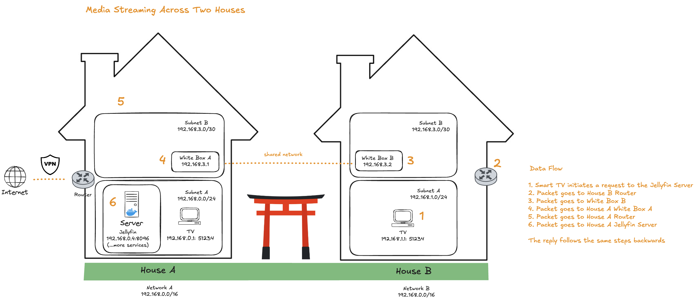

## 📺 Media Streaming Across Two Houses – Overview
This setup allows House B to stream content from a Jellyfin media server hosted in House A, using a private and secure network path without relying on public internet access.

### 🔄 Data Flow Summary:

1. TV in House B requests a movie from Jellyfin.

2. The request is routed via House B's router.

3. It passes through White Box B (a bridge device).

4. Crosses over the shared point-to-point network to White Box A in House A.

5. Packet reaches House A's router.

6. Finally, the Jellyfin server (at 192.168.0.4:8096) receives the request and starts streaming.

➡️ The reply takes the exact same path in reverse, ensuring smooth and secure delivery.

### 🎥 Video Explanation 

I used Excalidraw to create a diagram and recorded a video explaining the media streaming setup between two houses.

[TO DO: Add the link]